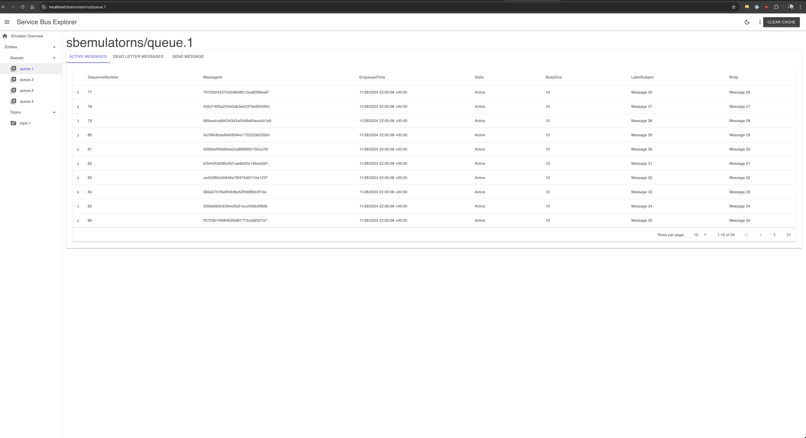

# Service Bus Emulator Explorer

This is a Blazor UI for the [service bus emulator](https://github.com/Azure/azure-service-bus-emulator-installer).



## Features

- [x] View active & deadlettered messages
- [x] Send messages to a queue (including Broker Properties & Custom Properties)

## Roadmap
- [ ] View subscriptions
- [ ] View topics

## Getting Started

The UI can be run locally or in a container.

### Running Locally

#### Prerequisites

The .NET 9.0 SDK is required to build and run the ui.

1. Clone the repository
2. Create a `.env` file in the repository root with the following content:
    ```
    ACCEPT_EULA=Y
    SQL_PASSWORD=your_password
    CONFIG_PATH=./service-bus-config.json
    ```
3. run `docker compose -f compose-services.yaml up -d`
4. run `dotnet run`
5. Navigate to `https://localhost:5261`

### Running in a container

#### Prerequisites

Ensure you've [configured the https certificate](https://learn.microsoft.com/en-us/aspnet/core/security/docker-compose-https?view=aspnetcore-9.0) for the ui. This may require editing the `docker-compose.yaml` file to point to the correct certificate.

1. Clone the repository
2. run `docker compose up -d`
3. Navigate to `https://localhost`

## Notes

- The emulator doesn't implement the Service Bus Administration apis so the UI will not be able to create topics or subscriptions. The ui is driven by `service-bus-config.json` to determine the topics and subscriptions to display.
- Messages are periodically refreshed, but the UI does not automatically update when new messages are added. Refresh the page to see new messages.
- The message cache can be cleared by clicking the "Clear Cache" button.

## Contributing

Contributions are welcome! Please open an issue or PR to discuss changes.
