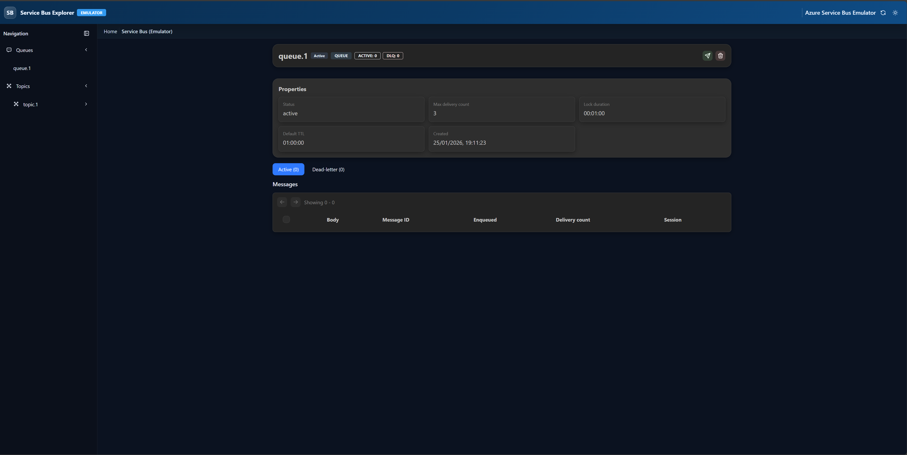

# Service Bus Emulator Explorer

A web-based UI for managing and exploring Azure Service Bus Emulator instances. This tool provides an intuitive interface to interact with queues, topics, subscriptions, and messages in the Azure Service Bus Emulator.



## 🚀 Features

### Queue Management

- **List and Create Queues**: View all queues with runtime properties (active/dead-letter message counts, size)
- **Send Messages**: Send messages to queues with custom properties and content
- **Peek Messages**: Preview messages in queues without consuming them
- **Delete Queues**: Remove queues from the emulator
- **Dead Letter Queue Management**: Bulk delete dead-letter messages

### Topic & Subscription Management

- **List and Create Topics**: Manage topics with real-time statistics
- **Send Messages to Topics**: Publish messages to topics for distribution to subscriptions
- **Subscription Management**: Create and manage subscriptions on topics
- **Peek Subscription Messages**: Preview messages in subscriptions
- **Delete Topics/Subscriptions**: Clean up resources

### Message Operations

- **Message Peeking**: View message content and properties without consuming
- **Dead Letter Queue Support**: View and manage dead-letter messages for both queues and subscriptions
- **Bulk Operations**: Bulk delete operations for dead-letter messages
- **Message Editor**: In-browser editor for message content with syntax highlighting

### Developer Experience

- **Modern React UI**: Built with React 19, Vite, and Fluent UI/Mantine components
- **Real-time Updates**: Automatic refresh of entity statistics
- **API Documentation**: OpenAPI/Scalar API documentation available
- **Monaco Editor**: In-browser code editor for message content
- **Observability**: Built-in OpenTelemetry support

## 📋 Prerequisites

- Docker and Docker Compose
- .NET 10.0 SDK (for local development)
- Node.js 18+ and npm/yarn (for frontend development)

## 🛠️ Setup

### Using Docker Compose (Recommended)

1. **Clone the repository**

   ```bash
   git clone <repository-url>
   cd Service-Bus-Emulator-Explorer
   ```

2. **Set environment variables**

   Create a `.env` file in the root directory:

   ```env
   ACCEPT_EULA=Y
   SQL_PASSWORD=YourStrongPassword123!
   ```

3. **Start the services**

   ```bash
   docker-compose up
   ```

   This will start:
   - Service Bus Emulator on ports `5672` (AMQP) and `5300` (Admin)
   - SQL Server (required by the emulator)
   - Service Bus Explorer UI on port `8080`

4. **Access the application**
   - Web UI: <http://localhost:8080>
   - API: <http://localhost:8080/api>
   - API Documentation: <http://localhost:8080/scalar/v1>

### Local Development Setup

#### Backend (.NET)

1. **Navigate to the backend directory**

   ```bash
   cd src/ServiceBusEmulatorExplorer
   ```

2. **Configure connection strings**

   Update `appsettings.Development.json`:

   ```json
   {
     "ServiceBus": {
       "ConnectionString": "Endpoint=sb://localhost;SharedAccessKeyName=RootManageSharedAccessKey;SharedAccessKey=SAS_KEY_VALUE;UseDevelopmentEmulator=true;",
       "AdministrationConnectionString": "Endpoint=sb://localhost:5300;SharedAccessKeyName=RootManageSharedAccessKey;SharedAccessKey=SAS_KEY_VALUE;UseDevelopmentEmulator=true;",
       "RefreshIntervalMs": 5000
     }
   }
   ```

3. **Run the backend**

   ```bash
   dotnet run
   ```

   The API will be available at <http://localhost:5123>

#### Frontend (React)

1. **Navigate to the frontend directory**

   ```bash
   cd app/sb-explorer-ui
   ```

2. **Install dependencies**

   ```bash
   npm install
   ```

3. **Run the development server**

   ```bash
   npm run dev
   ```

   The UI will be available at <http://localhost:5173>

4. **Build for production**

   ```bash
   npm run build
   ```

## 🔧 Configuration

### Backend Configuration (`appsettings.json`)

```json
{
  "ServiceBus": {
    "ConnectionString": "Endpoint=sb://localhost;SharedAccessKeyName=RootManageSharedAccessKey;SharedAccessKey=SAS_KEY_VALUE;UseDevelopmentEmulator=true;",
    "AdministrationConnectionString": "Endpoint=sb://localhost:5300;SharedAccessKeyName=RootManageSharedAccessKey;SharedAccessKey=SAS_KEY_VALUE;UseDevelopmentEmulator=true;",
    "RefreshIntervalMs": 5000,
    "EmulatorConfigFilePath": "service-bus-config.json"
  },
  "Otlp": {
    "Endpoint": "https://your-otel-endpoint",
    "Headers": ""
  }
}
```

### Observability Configuration

- `Otlp:Endpoint`: OTLP collector endpoint for OpenTelemetry
- `Otlp:Headers`: Additional headers for OTLP exporter
- `Otlp:EnableConsoleExporter`: Enable console exporter for debugging

### Frontend Configuration

Environment variables for the frontend (via `.env` or build scripts):

- `VITE_API_BASE_URL`: Backend API base URL (default: `/api`)
- `VITE_USE_MOCK`: Enable/disable mock data (for development)

## 📚 API Endpoints

### Queues

- `GET /api/queues` - List all queues
- `POST /api/queues` - Create a new queue
- `DELETE /api/queues/{name}` - Delete a queue
- `GET /api/queues/{name}/messages` - Peek messages in a queue
- `POST /api/queues/{name}/messages` - Send message to a queue

### Topics

- `GET /api/topics` - List all topics
- `POST /api/topics` - Create a new topic
- `DELETE /api/topics/{name}` - Delete a topic
- `POST /api/topics/{topic}/messages` - Send message to a topic

### Subscriptions

- `GET /api/topics/{topic}/subscriptions` - List subscriptions
- `POST /api/topics/{topic}/subscriptions` - Create a subscription
- `DELETE /api/topics/{topic}/subscriptions/{sub}` - Delete a subscription
- `GET /api/topics/{topic}/subscriptions/{sub}/messages` - Peek subscription messages

### Dead Letter

- `POST /api/deadletter/queue/{name}/delete` - Bulk delete queue DLQ messages
- `POST /api/deadletter/subscription/{topic}/{sub}/delete` - Bulk delete subscription DLQ messages

## 🧪 Testing

Run the test suite:

```bash
cd test/ServiceBusEmulatorExplorer.Tests
dotnet test
```

## 🏗️ Project Structure

```
Service-Bus-Emulator-Explorer/
├── app/
│   └── sb-explorer-ui/          # React frontend
│       ├── src/
│       │   ├── api/             # API client and hooks
│       │   ├── components/      # React components
│       │   └── routes/          # Page components
│       └── package.json
├── src/
│   └── ServiceBusEmulatorExplorer/  # .NET backend
│       ├── Endpoints/           # API endpoints
│       ├── Extensions/          # Service extensions
│       └── Program.cs           # Application entry point
├── test/
│   └── ServiceBusEmulatorExplorer.Tests/  # Unit tests
├── compose.yaml                 # Docker Compose configuration
└── sb-explorer.slnx             # .NET solution file
```

## 🐳 Docker

### Build Custom Image

```bash
docker build -t sb-explorer:local -f src/ServiceBusEmulatorExplorer/Dockerfile .
```

### Run with Custom Image

Update `compose.yaml` to use your local image:

```yaml
services:
  sb-explorer:
    image: sb-explorer:local
    # ... rest of configuration
```

## 🔍 Troubleshooting

### Service Bus Emulator Won't Start

- Ensure Docker is running
- Check that ports 5672 and 5300 are not in use
- Verify SQL password meets complexity requirements (uppercase, lowercase, numbers, special characters)
- Set `ACCEPT_EULA=Y` in your environment

### Connection Issues

- Verify the Service Bus emulator is running: `docker ps`
- Check connection strings in `appsettings.json`
- Ensure the emulator is accessible on the configured ports

### Frontend Can't Connect to Backend

- Verify backend is running on the expected port
- Check `VITE_API_BASE_URL` environment variable
- Review CORS configuration in `Program.cs`

## 📄 License

The frontend and backend code are licensed under the MIT License. See the [LICENSE](LICENSE) file for details.

## 🤖 Acknowledgements

The majority of the frontend code was written by OpenAI's ChatGPT codex model.

## ⚠️ Limitations

The administration client for the emulator does not expose all of the properties in some of the models, so some parts of the application may not show all available properties or invalid information.
